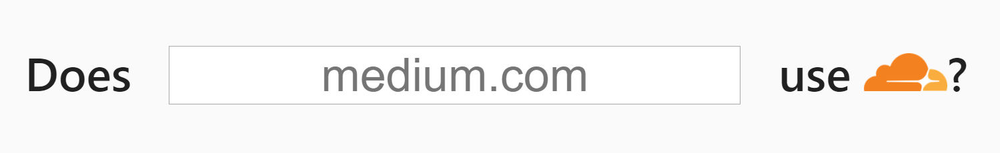

# cf-detect




[](https://saythanks.io/to/NicholasAdamou)

[About](#about) / [Installation](#installation) / [Credits](#credits) / [Related](#related) / [License](#license)

## About

`cf-detect` is a simple web application to check whether a site is running behind Cloudflare.

## Installation

Clone the repository and install all dependencies by running:

```
git clone https://github.com/nicholasadamou/cf-detect
cd cf-detect/
yarn install
```

Subsequently, create a `.env` file and declare a variable called `SECRET` (for session security purposes):

```
echo "SECRET=[your-secret-goes-here]" > .env
```

Finally, build the project by running:

```
yarn start
```

If you want to use [`docker`](https://docker.com) instead then you can do the following:

```
# Make sure you have docker installed before running the below commands.
# See https://docs.docker.com/get-docker/

make # Will build the docker image using the dockerfile.
docker-compose up
```

You can then access the service by navigating to [`localhost:3000`](http://localhost:3000/).

## Credits

- Cloudflare's logo was taken from [seeklogo.com](https://seeklogo.com/vector-logo/294312/cloudflare).

## Related

- [cloudflare-detect](https://github.com/k4m4/cloudflare-detect) - Detect whether a site is running behind Cloudflare.

## License

Copyright (c) by Nicholas Adamou. Some rights reserved.

`cf-detect` is under the terms of the **MIT License**, following all clarifications stated in the [license file](license.md).
